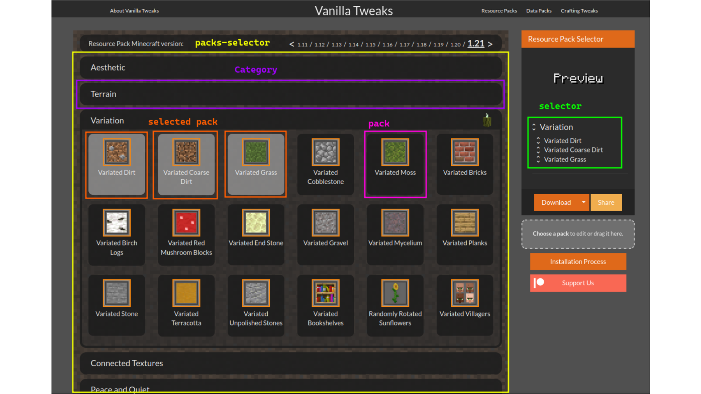

# vtwupdater — Vanilla Tweaks Resource Pack Updater

> A client-side script to seamlessly update Vanilla Tweaks Minecraft resource packs to newer game versions.

[Vanilla Tweaks](https://vanillatweaks.net/) is a popular website for Minecraft that allows you to create custom data packs, resource packs, and crafting tweaks. This utility was designed specifically for the [Resource Packs section](https://vanillatweaks.net/picker/resource-packs/) to help you migrate your customized pack to a newer game version without losing your selections.

> **⚠️ DEPRECATION NOTICE**  
> When this code was originally created, Vanilla Tweaks did not have a built-in feature to automatically update your resource packs between game versions. **Today, the website natively supports this feature.**  
>
> Because of this, this software is technically deprecated. However, it remains fully functional, and you are more than welcome to continue using it, study the code, or fork it for your own educational purposes!

---

## How to Use It

Follow these steps to update your resource pack using the console script:

1. **Upload your pack:** Go to the Vanilla Tweaks website and upload your existing resource pack (`.zip` file) so your current selections are loaded.
2. **Inject the script:** Open your browser's Developer Console (usually `F12` or `Ctrl+Shift+J`). Copy the entire code from `main.js` (or the compiled `main.ts`), paste it into the console, and press **Enter**.
3. **Change the version:** In the Vanilla Tweaks user interface, change the Minecraft version to your desired target version. *(Note: If you skip this step and try to run the script, it will alert you and stop the execution).*
4. **Run the updater:** Go back to the browser console, type `main()`, and press **Enter**.
5. **Done!** The visual grid (`packs-selector`), the side list (`selector`), and the internal data objects (`selectedPacks` and `selectedPacksShow`) will instantly sync to match your original selections in the new version.

---

## ⚠️ Important Notes

* **Category changes:** If Vanilla Tweaks moved a specific pack to a different sub-category in the newer version, the script will still mark it as selected visually, though it might not align perfectly with the site's new internal structure.
* **Downgrading:** This utility does not verify if you are selecting an older Minecraft version than what the pack was originally designed for. If you downgrade to a very old version, some textures will likely break or display bugs in-game.
* **Reverse Engineering:** The source code of Vanilla Tweaks is not public. This tool was built by analyzing the website's DOM and console behaviors.

---

## Glossary

To help you understand the source code and how it interacts with the website:

* **Pack:** The individual changes/textures that will be applied to the final downloaded resource pack.
* **Category:** A group containing multiple packs of the same kind.
* **selectedPacks:** The website's internal JavaScript object containing the packs you have selected and the categories they belong to.
* **selectedPacksShow:** Similar to `selectedPacks`, but specifically used by the site to render the list inside the side panel.
* **selector:** The HTML `div` element (containing a `ul`) on the right side of the screen used to list all your currently selected packs.
* **packs-selector:** The main HTML `div` container in the center of the screen that holds all the visual categories and thumbnails.

### Visual Reference

Enjoy the tool! 🛠️
